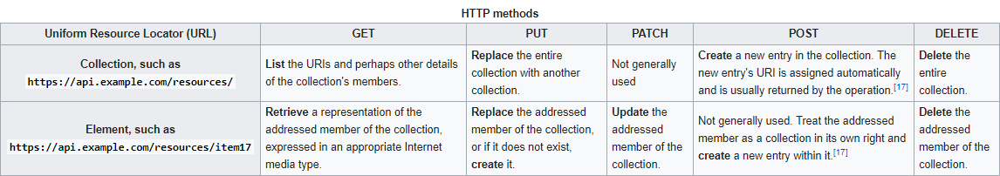

# Rest Api

* Homework [2]: Create an application that provides a RESTFull API. Observation: Is mandatory to use at least: GET, POST,PUT, DELETE. It is very important to respect all additional requirements specified in the laboratory.

* A REST API defines a set of functions that can be used to perform requests and receive responses via HTTP protocol.
* There are some confusions between some methods, like PUT vs POST, and in this homework I implemented the methods after the above image.
* I use a json file for my database. The rest is base-built on the url, I used some personalized url to make an implementation for the http methods (using split method).
* HTTP Methods that I implemented in the homework:
	* GET    /products/fruit?=fruitName
	* PUT    /products/fruit=fruitName&method=methodName
	* POST   /products/fruit=fruitName&method=methodName
	* DELETE /products/fruit=fruitName&method=methodName

* This version of my rest api is not completed yet (I didn't provide verification if some data didn't exists in database and I didn't use status code for different type of cases).
